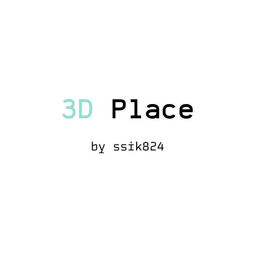

## About

 3D Place is a personal project. The main focus is show the power of 3d models on websites and show how the website was made! 

## Getting Started :space_invader:

First, run the development server:

```bash
npm run dev
# or
yarn dev
```

Open [http://localhost:3000](http://localhost:3000) with your browser to see the result.

You can start editing the page by modifying `pages/index.js`. The page auto-updates as you edit the file.

## Folders :computer:

## pages

Contain the pages and scenes with 3D Models.

## patterns

HTML semantic components with styled-components

## public

Contain the public files (images and icons) and subpastes with textures, font and models 

## styles

Paste with the global style

## Components 

Components for page construction -> buttons, footer, navbar and head.

## Models-js

Models converted  (javascript files).